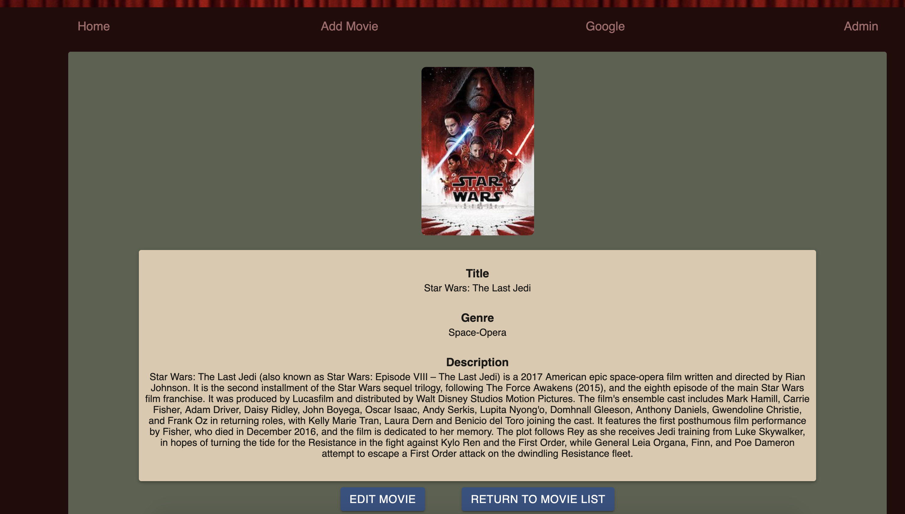
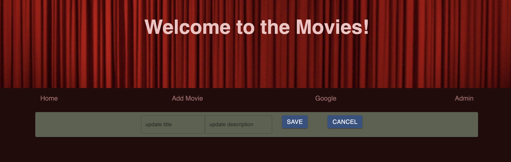
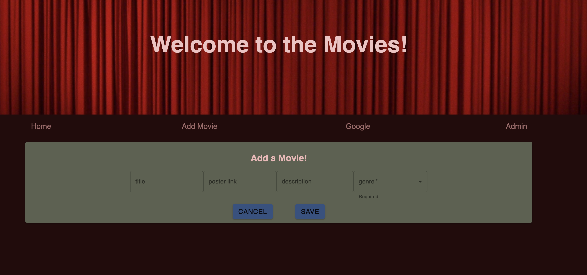

Readme

Questions to ask when making a readme
What is it?
How to run it?
How to use it? (sometimes, needed more for complex apps)

EXAMPLE

# Movie List App
## Description
_Duration:_ Weekend project
This is a movie list app that stores movies and allows the user to view, add, or update the movie.

In building this app, I practiced skills for full stack integration, connecting a react-powered front end through a node server to a SQL database.

## Screenshots

## Prerequisites 
To run this app you will need:
- React/Redux
- Node.js
- PostGreSQL

## Install
To run this application:
- create a database in postgres called `saga_movies_weekend`
- Execute the SQL commands from `database.sql`
- Run `npm install` from the project root directory
- Run `npm start` to run the node server
- Open `http://localhost:3000` in your server

## Usage
- View movies and click on one for more details.
- In the details page either click _Return to Movie List_ or click _Edit Movie_.
- In the Add Movie page fill in the fields and click _Save_ to add the movie and return to the home page, otherwise click _Cancel_ and return to the home page.
